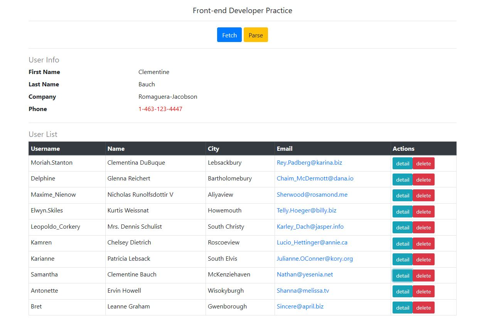
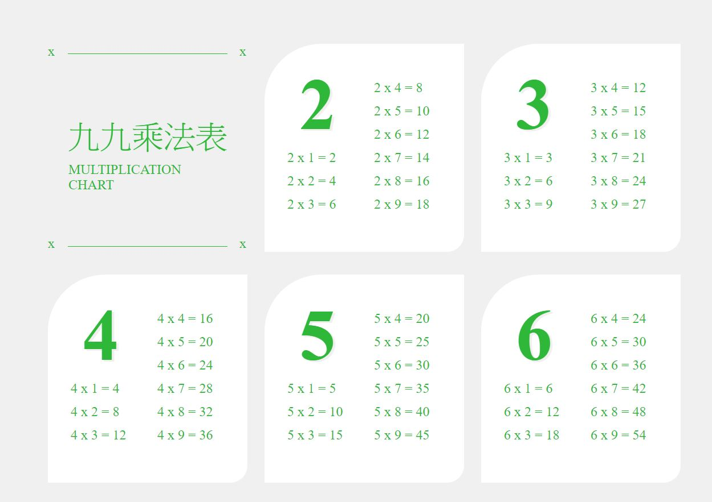

<h2> <a href="https://tdtb12.github.io/puzzle/">Puzzle </a> </h2>
</img>
練習的作品，使用CSS切割左方圖片並隨機放置，一格為空並放置在按鈕下方，使用者可移動相鄰的圖片使圖片交換
，點選按鈕下方保留圖片可加入到九宮格，當正確重組後顯示完成。
可在IE8及Chrome中運行，使用clip切割圖片，JavaScript執行我自己寫的drag-and-drop功能以交換相鄰圖片。

<h2> <a href="https://tdtb12.github.io/json">Json</a> </h2>
</img>
進入網頁後表格為空，按下Fetch鈕之後表格會顯示Json中資料內容，再按下parse鈕之後username欄位會轉換成小寫文字，並且email欄位點選之後會以新視窗開啟，每列都有detail及delete，點選detail會讀取Json資料並在上方userinfo顯示該user的詳細資料，點選delete可以刪除user的資料，使用BootStrap美化頁面。

<h2> <a href="https://tdtb12.github.io/Multiplication%20Chart/">Multiplication Chart</a> </h2>
</img>
參考版面的配置並且使用CSS、HTML、Javascript做出相同的畫面。
<a href="https://reurl.cc/2kk8E">參考頁面</a>
